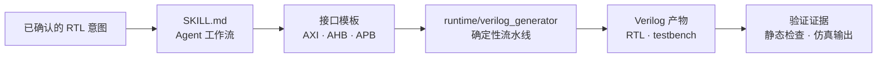
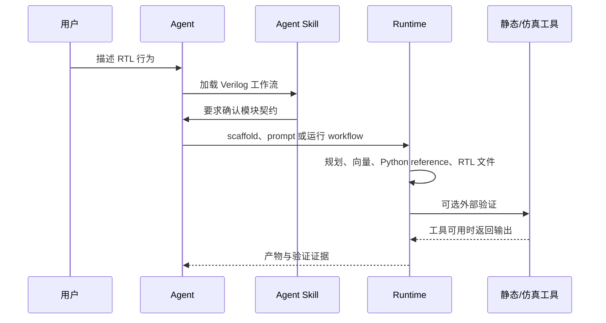

<p align="center">
  <a href="README.md">English</a>
  <span>&nbsp;|&nbsp;</span>
  <a href="README-CN.md"><strong>中文</strong></a>
</p>

<p align="center">
  
</p>

<p align="center">
  <a href="LICENSE"></a>
  <a href="pyproject.toml"></a>
  <a href="SKILL.md"></a>
  <a href="ENGINEERING_DESIGN_GOALS.md"></a>
</p>

<h1 align="center">Verilog Generator</h1>

<p align="center">
  面向 Codex/Agent 的 Verilog-2001 RTL 专业工作流 Skill。
</p>

Verilog Generator 用来把 AI 编程代理变成更可靠的 RTL 工程助手。它提供触发元数据、工作流指令、接口模板、确定性 runtime、示例和验证门禁，帮助 Agent 从确认后的硬件意图稳定推进到可综合 Verilog 与自检查 testbench。

这个仓库首先是一个 **Agent Skill Package**。Python CLI 是确定性执行层，但主要入口是 Agent 可加载、可遵循的 skill 结构。

## 为什么需要它

RTL 工作在写代码之前就需要精确确认。Verilog Generator 会要求 Agent 先确认模块名、端口、时钟/复位行为、流水线期望、接口族、参考行为和验证用例，然后再生成产物。

适用场景包括：

- 可综合 Verilog-2001 RTL 模块。
- 自检查 Verilog testbench。
- 用于语义比对的 Python reference contract。
- AXI-Stream、AXI4-Lite、AXI4、AHB、APB、native 或 custom 接口形态。
- 静态验证、仿真就绪检查、workflow trace 和生成产物审查。

## Skill 架构



## 工作流



## 仓库结构

| 路径 | 作用 |
| --- | --- |
| `SKILL.md` | 面向 Agent 的触发、流程、约束和工具使用规则。 |
| `agents/openai.yaml` | Skill 列表和调用入口的 UI 元数据。 |
| `runtime/verilog_generator/` | scaffold、prompt 渲染、抽取、验证、trace 和 workflow 状态。 |
| `integration/verilog_adapter.py` | 面向宿主应用的稳定接口。 |
| `assets/interface_templates/` | AXI-Stream、AXI4-Lite、AXI4、AHB、APB 接口模板。 |
| `assets/examples/` | 示例 spec 和用于验证/回归的固定 RTL fixtures。 |

## 快速开始

把本仓库放入 Codex skill 搜索路径即可作为 Agent Skill 使用。开发 runtime 或做本地检查时：

```powershell
python -m runtime.verilog_generator --version
python -m runtime.verilog_generator scaffold --name rtl_adapter --out .\reports\verilog\spec.json
python -m runtime.verilog_generator prompt --spec .\reports\verilog\spec.json --out .\reports\verilog\prompt.md
```

不依赖外部 HDL 工具的静态验证：

```powershell
python -m runtime.verilog_generator validate --spec .\reports\verilog\spec.json --path .\reports\verilog\generated --no-external
```

外部验证需要真实 HDL 工具。只有实际运行 Vivado/xsim、VCS、iverilog 或 yosys 后，才可以声称对应工具验证通过。

## 集成接口

```python
from integration.verilog_adapter import (
    render_verilog_prompt,
    run_verilog_workflow,
    validate_verilog_artifacts,
)
```

- `run_verilog_workflow(...)`：运行或恢复分阶段 RTL 工作流。
- `render_verilog_prompt(...)`：宿主系统自行调用模型时渲染 prompt。
- `validate_verilog_artifacts(...)`：下游使用前验证生成 RTL。

## 边界

- 生成 Verilog-2001 `.v` 产物和自检查 Verilog testbench。
- 不生成 HLS、C/C++ kernel 或其他 RTL 方言。
- 为了更容易进行波形调试，优先使用显式逻辑，而不是 Verilog `function` 和 `task`。
- 本地密钥、私有硬件设计、生成缓存和私有远程服务器细节不应进入仓库。

## 联系方式

问题、合作或学术使用，请联系：[erie@seu.edu.cn](mailto:erie@seu.edu.cn)。

## 引用

如果本 skill 对你的研究、教学或工程流程有帮助，请引用：

```bibtex
@software{verilog_generator_skill,
  title        = {Verilog Generator: An Agent Skill for Verilog-2001 RTL Workflows},
  author       = {{Verilog Generator Authors}},
  year         = {2026},
  license      = {Apache-2.0},
  contact      = {erie@seu.edu.cn}
}
```

GitHub 引用元数据见 [CITATION.cff](CITATION.cff)。

## 许可证

Apache License 2.0，详见 [LICENSE](LICENSE)。
