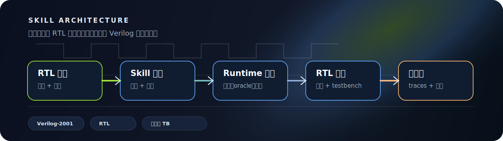
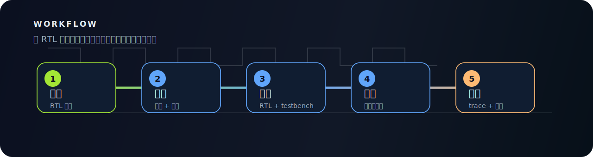

<p align="center">
  <a href="README.md">English</a>
  <span>&nbsp;|&nbsp;</span>
  <a href="README-CN.md"><strong>中文</strong></a>
</p>

<p align="center">
  
</p>

<p align="center">
  <a href="LICENSE"></a>
  <a href="pyproject.toml"></a>
  
  <a href="SKILL.md"></a>
  <a href="ENGINEERING_DESIGN_GOALS.md"></a>
</p>

<h1 align="center">Verilog Generator</h1>

<p align="center">
  面向 Codex/Agent 的 Verilog-2001 RTL 专业工作流 Skill。
</p>

Verilog Generator 用来把 AI 编程代理变成更可靠的 RTL 工程助手。它提供触发元数据、工作流指令、接口模板、确定性 runtime、示例和验证门禁，帮助 Agent 从确认后的硬件意图稳定推进到可综合 Verilog 与自检查 testbench。

这个仓库首先是一个 **Agent Skill Package**。Python CLI 是确定性执行层，但主要入口是 Agent 可加载、可遵循的 skill 结构。

## 为什么需要它

RTL 工作在写代码之前就需要精确确认。Verilog Generator 会要求 Agent 先确认模块名、端口、时钟/复位行为、流水线期望、接口族、参考行为和验证用例，然后再生成产物。

适用场景包括：

- 可综合 Verilog-2001 RTL 模块。
- 自检查 Verilog testbench。
- 用于语义比对的 Python reference contract。
- AXI-Stream、AXI4-Lite、AXI4、AHB、APB、native 或 custom 接口形态。
- 静态验证、仿真就绪检查、workflow trace 和生成产物审查。

## Skill 架构

<p align="center">
  
</p>

## 工作流

<p align="center">
  
</p>

## v0.2.8 重点更新

- 新增 RTL-MD 约束目录：通过 `references/rtl-md-constraints.md` 与 `assets/rtl_md_constraints.json` 将 MUST/REC RTL 规则接入 prompt、static lint 和 review evidence。
- 新增只读 workflow routing：`runtime/verilog_generator/workflow_router.py` 可在写入产物前判断应进入 spec-first generation、plan-seeded generation、existing-RTL assist 或 evidence-first repair。
- 强化 ADC/DAC family guidance：打包 JESD、SPI 和 mixed-signal use-case templates，为板级提示上下文提供模板化参考。
- 扩展 validation 与 verify-repair 覆盖，让 RTL-MD 约束、诊断路由和 workflow report 在本地与远程验证路径中都能被检查。

## 仓库结构

| 路径 | 作用 |
| --- | --- |
| `SKILL.md` | 面向 Agent 的触发、流程、约束和工具使用规则。 |
| `agents/openai.yaml` | Skill 列表和调用入口的 UI 元数据。 |
| `runtime/verilog_generator/` | scaffold、prompt 渲染、抽取、验证、trace 和 workflow 状态。 |
| `integration/verilog_adapter.py` | 面向宿主应用的稳定接口。 |
| `assets/interface_templates/` | AXI-Stream、AXI4-Lite、AXI4、AHB、APB 接口模板。 |
| `assets/refined_verilog_templates/` | 可复用的 refined RTL shell 片段与端口分组模板。 |
| `assets/use_case_templates/` | 打包的 JESD、SPI 和 mixed-signal 参考模板，包含 RTL、Tcl 与约束骨架。 |
| `assets/examples/` | 示例 spec、remote fixtures、existing-RTL 输入，以及 refined template 输入样例。 |
| `evals/` | 仓库内 skill-effectiveness 用例，用于 workflow 与 remote-validation 回归检查。 |
| `RELEASE_RECEIPT.json` | 导入的 `v0.2.8` 发布包来源记录。 |

## 快速开始

直接告诉你的 AI：请安装 https://github.com/Eriemon/verilog-generator

把本仓库放入 Codex skill 搜索路径即可作为 Agent Skill 使用。开发 runtime 或做本地检查时：

```powershell
python -m runtime.verilog_generator --version
python -m runtime.verilog_generator scaffold --name rtl_adapter --out .\reports\verilog\spec.json
python -m runtime.verilog_generator prompt --spec .\reports\verilog\spec.json --out .\reports\verilog\prompt.md
```

不依赖外部 HDL 工具的静态验证：

```powershell
python -m runtime.verilog_generator validate --spec .\reports\verilog\spec.json --path .\reports\verilog\generated --no-external
```

外部验证需要真实 HDL 工具。只有实际运行 Vivado/xsim、VCS、iverilog 或 yosys 后，才可以声称对应工具验证通过。

`v0.2.8` 这一版新增 RTL-MD 约束、workflow routing、ADC/DAC use-case guidance，并强化 prompt、lint 与 verify-repair 流程的验证覆盖。

## 集成接口

```python
from integration.verilog_adapter import (
    analyze_existing_verilog,
    compare_verilog_semantics,
    refine_existing_verilog,
    render_verilog_prompt,
    run_verilog_batch,
    run_verilog_workflow,
    validate_verilog_artifacts,
    verify_existing_verilog,
)
```

- `analyze_existing_verilog(...)`：把现有 RTL 分析成稳定 JSON 契约，并输出可复用的设计说明。
- `refine_existing_verilog(...)`：规划 tb scaffold、style refine、partition assist、merge assist、optimize assist 等受控 refine 流程。
- `compare_verilog_semantics(...)`：比较 candidate 与 reference RTL 的接口和 checkpoint 漂移。
- `run_verilog_batch(...)`：在相互隔离的 case run 目录中执行仅生成型 batch 流程。
- `run_verilog_workflow(...)`：运行或恢复分阶段 RTL 工作流。
- `render_verilog_prompt(...)`：宿主系统自行调用模型时渲染 prompt。
- `validate_verilog_artifacts(...)`：下游使用前验证生成 RTL。
- `verify_existing_verilog(...)`：运行 existing-RTL verify-repair 闭环并输出诊断、patch plan 与闭环工件。

## 边界

- 生成 Verilog-2001 `.v` 产物和自检查 Verilog testbench。
- 不生成 HLS、C/C++ kernel 或其他 RTL 方言。
- 为了更容易进行波形调试，优先使用显式逻辑，而不是 Verilog `function` 和 `task`。
- 本地密钥、私有硬件设计、生成缓存和私有远程服务器细节不应进入仓库。
- 项目本地远程配置应放在 `.settings/` 下，这个公开仓库不会继续保留 repo-tracked `smoke/` 或测试型验证源码目录。

## 机构说明

Jiyuan Liu 和 He Li 隶属于东南大学电子科学与工程学院。
两位作者所在团队为东南大学电子科学与工程学院异构智能与量子计算实验室（HIQC课题组），相关工作面向异构智能、量子计算及相关计算系统研究。

## 联系方式

问题、合作或学术使用，请联系：[erie@seu.edu.cn](mailto:erie@seu.edu.cn)。

## 引用

本 skill 由东南大学电子科学与工程学院异构智能与量子计算实验室（HIQC课题组）相关作者维护。

如果本 skill 对你的研究、教学或工程流程有帮助，请引用。规范引用元数据以 [CITATION.cff](CITATION.cff) 为准。

```bibtex
@software{liu_2026_verilog_generator,
  author       = {Jiyuan Liu and He Li},
  title        = {{Verilog Generator}: An Agent Skill for Verilog-2001 RTL Workflows},
  year         = {2026},
  version      = {0.2.8},
  date         = {2026-06-10},
  url          = {https://github.com/Eriemon/verilog-generator},
  license      = {Apache-2.0},
  note         = {Agent skill package for disciplined Verilog-2001 RTL workflows}
}
```

## 许可证

Apache License 2.0，详见 [LICENSE](LICENSE)。
