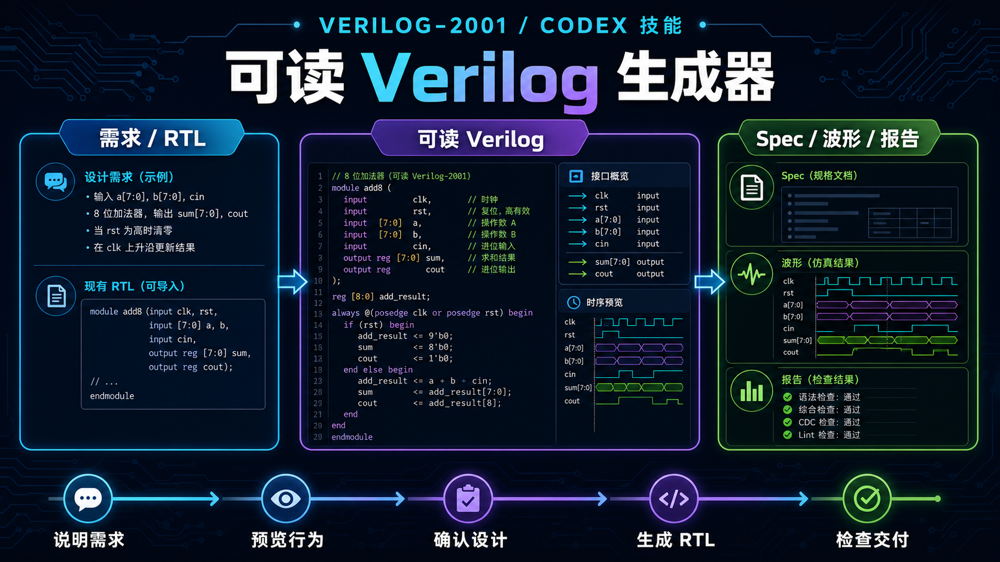
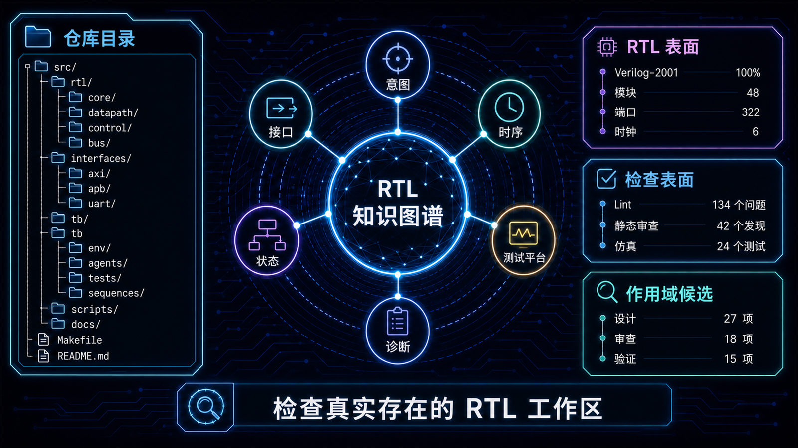
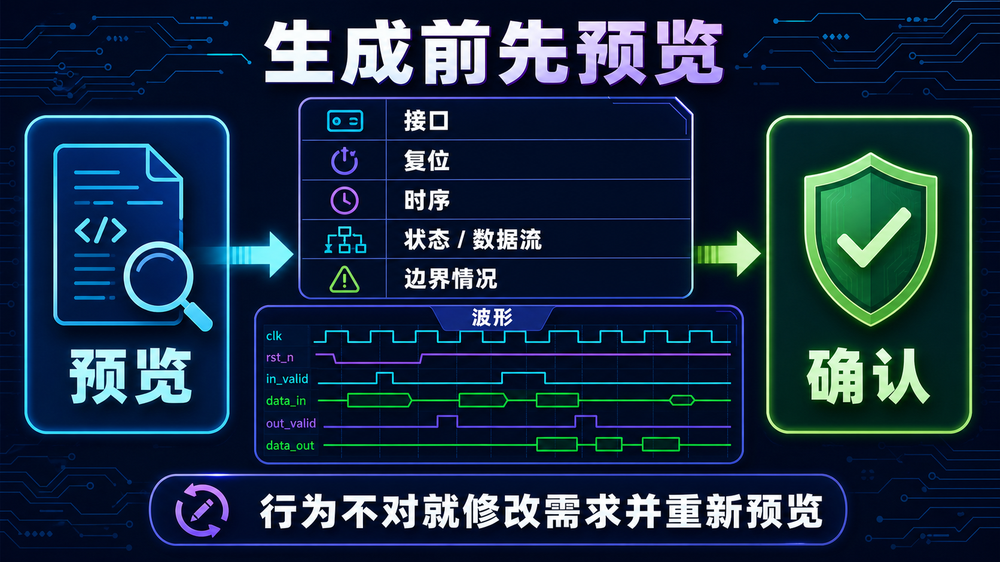
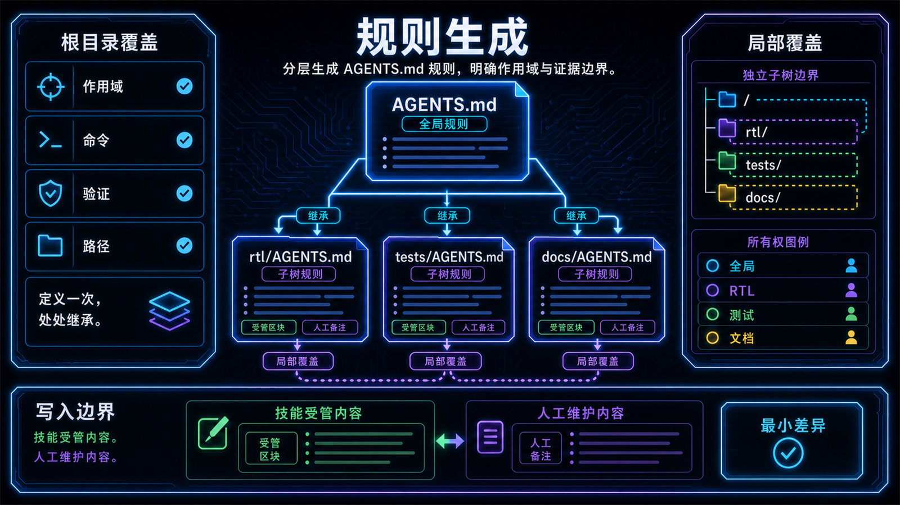

<p align="center">
  <a href="README.md">English</a>
  <span>&nbsp;|&nbsp;</span>
  <a href="README-CN.md"><strong>中文</strong></a>
</p>

<p align="center">
  
</p>

<p align="center">
  <a href="LICENSE"></a>
  
  
  
</p>

<p align="center">
  <strong>可读 RTL → 行为清晰 → 交付可审查</strong><br>
  把设计意图交给 AI，先看行为预览，再获得可以检查和验证的结果。
</p>

Verilog Generator 是一个面向实际 Verilog-2001 工作的 Codex 技能。它可以根据需求创建模块，解释现有 RTL，补充语义注释，根据真实诊断修复问题，并运行任务真正需要的检查。

## 它有什么用

- 把模块需求转换为可读、可综合的 Verilog-2001 RTL。
- 从端口、时钟/复位、状态、时序和数据流解释现有模块。
- 在不悄悄改变 RTL 行为的前提下补充或改进语义注释。
- 根据编译器、lint、仿真器或工具日志修复现有设计。
- 在环境可用时准备 testbench 骨架或请求真实仿真结果。

技能会明确区分结果来源：静态审查、仿真、综合和硬件结果分别报告。没有实际运行的检查，不会被写成已经完成。

## 安装

> 让 AI 安装 https://github.com/Eriemon/verilog-generator 中的技能。

安装后，在同一对话中使用 `$readable-verilog-generator` 调用技能，或者直接描述你的 Verilog 任务。

## 需要准备什么

根据任务准备相应材料即可：



- **新建模块：** 功能、模块名、端口、时钟和复位语义、逐周期行为、协议规则、边界情况，以及你希望执行的检查。
- **审查现有 RTL：** `.v` 文件、相关 testbench 或集成背景，以及希望重点检查的问题。
- **补充注释或修复：** 原始 RTL、诊断信息或日志、期望行为，以及本次只能改注释还是允许修改逻辑。
- **仿真或外部验证：** 含有期望结果的可用 testbench、仿真器/工具环境，以及必要的工程或远程访问条件。

如果缺少会影响结果的重要信息，技能会先询问，不会直接做出高影响修改。

## 如何调用

直接用自然语言描述任务即可。下面的示例可以复制后修改：

```text
使用 $readable-verilog-generator 创建一个 Verilog-2001 AXI-Stream 数据包计数器。
先询问缺少的接口和时序信息，再展示模块 Spec 和 WaveDrom 行为预览，
等我确认后再生成 RTL。
```

```text
使用 $readable-verilog-generator 审查这份 RTL 的复位行为、握手错误、位宽问题、
命名、注释和综合风险。只输出审查结果，不修改文件。
```

```text
使用 $readable-verilog-generator 为这份 Verilog 文件补充语义注释。
保留所有 RTL token，并展示仅注释变化的校验结果。
```

```text
使用 $readable-verilog-generator 根据附带的仿真日志诊断并修复这个模块。
先展示拟议修改和验证结果，再写入最终文件。
```

## 先预览并确认，再生成

对于新模块或会改变行为的修复，先要求 AI 给出预览，再要求写入最终 RTL。预览至少应让以下内容清楚可见：



1. 接口、端口方向和位宽、时钟以及复位行为。
2. 状态转换、握手条件、数据路径时序和边界情况。
3. 至少一个展示逐周期行为的 WaveDrom 场景。
4. 将要执行的检查，以及每种结果能够证明什么。

确认前先核对预览是否符合你的设计意图。如果不符合，就修改需求并重新预览；未确认的理解不能直接当作最终设计。

## 最终得到什么

根据任务不同，交付结果可以包括：



- 可读的 Verilog-2001 源文件（`.v`）；
- 与模块同名的规范说明（`<module>_spec.md`）；
- WaveDrom 行为文件（`.json5` 和渲染后的 `.svg`）；
- 按需生成或更新的 testbench；
- 只包含实际运行检查结果的审查、修复、静态检查、仿真或工具报告；
- 对剩余假设、警告和未验证范围的简洁说明。

## 审查并交付


接受交付前，先查看生成的文件和实际运行过的检查；剩余假设与未验证范围应保持清楚可见。

## 结果示例

下面的示例是一个 32 位 AXI-Stream 计量器。它只在 `TVALID` 与 `TREADY` 完成传输后统计字节，在完成传输的 `TLAST` 上统计数据包，并在达到上限后饱和，不发生回卷。

```verilog
// AXI-Stream 事务判定
assign flag_transfer = i_axis_tvalid & i_axis_tready;
assign flag_packet_end = flag_transfer & i_axis_tlast;

always@(posedge i_axis_aclk or negedge i_axis_arstn)begin
	if(i_axis_arstn == 1'b0)begin
		cnt_packet_o <= 32'd0;
	end else if(i_clear == 1'b1)begin
		cnt_packet_o <= 32'd0;
	end else if(flag_packet_end == 1'b1)begin
		if(data_frame_sum[32] == 1'b0)begin
			cnt_packet_o <= data_frame_sum[31:0];
		end else begin
			cnt_packet_o <= 32'hFFFF_FFFF;
		end
	end
end
```

**[查看完整注释源码 →](assets/examples/readme/axis_packet_meter.v)**

| 示例检查 | 结果 |
| --- | ---: |
| Formatter AST | `PASS` |
| 可读性、注释、命名、Profile | `PASS` |
| 错误 | `0` |
| 严格警告 | `0` |

> 这里是公开示例的静态结果，不代表已经运行仿真器、综合工具、硬件目标或远程环境。

## 作者与引用

Jiyuan Liu、He Li · Southeast University（东南大学）· HIQC（Heterogeneous Intelligence and Quantum Computing Laboratory）

如果本技能支持了你的研究、教学或工程工作，请引用 [CITATION.cff](CITATION.cff)。

```bibtex
@software{liu_2026_verilog_generator,
  author       = {Jiyuan Liu and He Li},
  title        = {{Verilog Generator}: An Agent Skill for Verilog-2001 RTL Workflows},
  year         = {2026},
  version      = {1.3.2},
  date         = {2026-08-12},
  url          = {https://github.com/Eriemon/verilog-generator},
  license      = {Apache-2.0},
  note         = {Agent skill for readable Verilog-2001 RTL workflows}
}
```

---

<p align="center">
  <a href="SKILL.md">技能详情</a>
  <span>&nbsp;&bull;&nbsp;</span>
  <a href="LICENSE">Apache License 2.0（Apache-2.0）</a>
  <span>&nbsp;&bull;&nbsp;</span>
  <a href="CITATION.cff">引用</a>
  <span>&nbsp;&bull;&nbsp;</span>
  <a href="mailto:<REDACTED_EMAIL>">联系</a>
</p>
