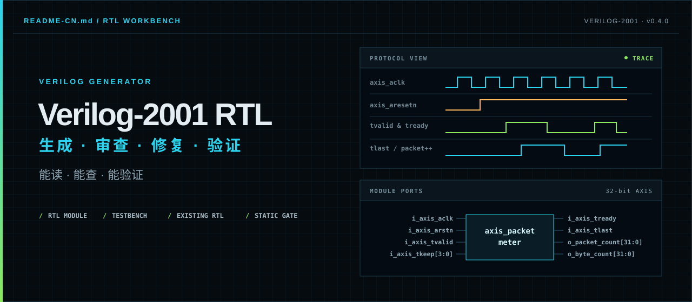
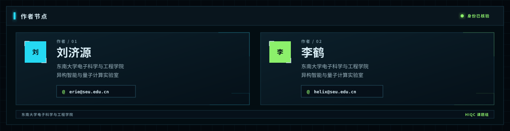

<p align="center">
  <a href="README.md">English</a>
  <span>&nbsp;|&nbsp;</span>
  <a href="README-CN.md"><strong>中文</strong></a>
</p>

<p align="center">
  
</p>

<p align="center">
  <a href="LICENSE"></a>
  
  
  
</p>

<p align="center">
  给出端口、时钟、复位和行为。交付能读、能查、能验证的 RTL。
</p>

## Verilog Generator 是什么

Verilog Generator 是一个面向日常 Verilog-2001 开发的 Codex Skill。把模块需求、现有 RTL、testbench 或工具日志交给它，它可以编写新模块、解释旧代码、补充有用注释，或根据真实诊断修复问题。

这个项目只坚持一件事：生成的 RTL 应该让下一位工程师容易读、容易审查、也容易验证。实际做过哪些检查会被明确记录；没有运行过的仿真或综合，不会被写成已经验证。

## 它能做什么

<table>
  <tr>
    <td width="33%">
      <strong>01 / 写一个新模块</strong><br><br>
      从端口、时钟/复位行为、时序预期和关键检查开始。<br><br>
      <code>Verilog-2001 RTL · testbench · 检查记录</code>
    </td>
    <td width="33%">
      <strong>02 / 把旧 RTL 看清楚</strong><br><br>
      给出模块、testbench 或失败日志，拿到接口、状态机、时序路径和风险说明。<br><br>
      <code>结构 · 行为 · 风险位置</code>
    </td>
    <td width="33%">
      <strong>03 / 修到有证据</strong><br><br>
      按预期行为和真实诊断修复，同时保留可审查的差异与验证边界。<br><br>
      <code>补丁 · 差异 · 静态或真实工具证据</code>
    </td>
  </tr>
</table>

## 生成结果示例

下面的示例是一个 32 位 AXI-Stream 计量器。它只在 `TVALID` 与 `TREADY` 完成握手时统计有效字节，在完成传输的 `TLAST` 上统计数据包，并在溢出前进入饱和状态，不发生回卷。

`erie_strict` 使用中文优先的语义注释。注释解释事务条件、数据边界和饱和策略，不复述语法。

```verilog
//AXI-Stream 事务判定
assign flag_transfer = i_axis_tvalid & i_axis_tready; // 仅在发送方与接收方同时就绪时采样
assign flag_packet_end = flag_transfer & i_axis_tlast; // 完成握手且 tlast 有效时结束数据包

//数据包计数器在数据包末拍握手后递增并在上限处饱和
always@(posedge i_axis_aclk or negedge i_axis_arstn)begin
	if(i_axis_arstn == 1'b0)begin
		cnt_packet_o <= 32'd0;              // 异步复位清空数据包累计值
	end else if(i_clear == 1'b1)begin
		cnt_packet_o <= 32'd0;              // 软件清零请求同步清空数据包统计
	end else if(flag_packet_end == 1'b1)begin
		if(data_frame_sum[32] == 1'b0)begin
			cnt_packet_o <= data_frame_sum[31:0]; // 未产生进位时记录新完成的数据包
		end else begin
			cnt_packet_o <= 32'hFFFF_FFFF;  // 达到上限后保持最大数据包计数
		end
	end else begin
		cnt_packet_o <= cnt_packet_o;       // 当前拍未结束数据包时保持累计值
	end
end
```

**[查看完整注释源码 →](docs/examples/axis_packet_meter.v)**

| 仓库本地静态门禁 | 结果 |
| --- | ---: |
| Formatter AST | `PASS` |
| 可读性、注释、命名、Profile | `PASS` |
| 错误 | `0` |
| 严格警告 | `0` |

> 这里只展示仓库本地静态证据，不声称已经执行仿真、综合、硬件或远程工具验证。

## 安装

> 告诉 Codex：`请安装 https://github.com/Eriemon/verilog-generator`

安装后重启 Codex，让它重新发现该 Skill。

需要固定版本时，使用 `v0.4.0` tag，或从 [GitHub Releases](https://github.com/Eriemon/verilog-generator/releases) 下载 `erie-verilog-generator-v0.4.0.zip`。

## 作者

<p align="center">
  
</p>

## 如何引用

> 如果本 Skill 对研究、教学或工程工作有帮助，请引用下面的版本；规范元数据始终以 [CITATION.cff](CITATION.cff) 为准。

```bibtex
@software{liu_2026_verilog_generator,
  author       = {Jiyuan Liu and He Li},
  title        = {{Verilog Generator}: An Agent Skill for Verilog-2001 RTL Workflows},
  year         = {2026},
  version      = {0.4.0},
  date         = {2026-07-05},
  url          = {https://github.com/Eriemon/verilog-generator},
  license      = {Apache-2.0},
  note         = {Agent skill package for disciplined Verilog-2001 RTL workflows}
}
```

---

<p align="center">
  <a href="SKILL.md">Skill 约束</a>
  <span>&nbsp;·&nbsp;</span>
  <a href="LICENSE">Apache-2.0</a>
  <span>&nbsp;·&nbsp;</span>
  <a href="CITATION.cff">引用</a>
  <span>&nbsp;·&nbsp;</span>
  <a href="mailto:erie@seu.edu.cn">联系</a>
</p>
