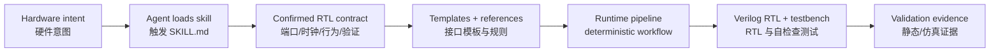
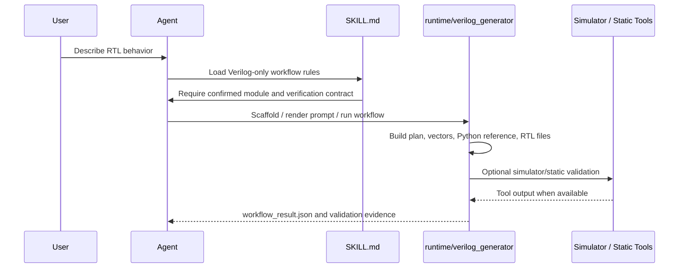

# Erie Verilog Generator


[](LICENSE)
[](pyproject.toml)
[](SKILL.md)
[](ENGINEERING_DESIGN_GOALS.md)

**Erie Verilog Generator is a Codex-ready agent skill for disciplined Verilog-2001 RTL generation.** It gives an AI coding agent a structured path from confirmed hardware intent to synthesizable Verilog, self-checking testbenches, validation evidence, and reviewable workflow traces.

**Erie Verilog Generator 是一个面向 Codex/Agent 的 Verilog RTL Skill。** 它不是普通脚本项目，而是一套让 AI 编程代理稳定完成 RTL 需求确认、参考模型构建、Verilog 生成、testbench 生成和验证证据归档的专业工作流。

## What This Skill Does / 作用定位

This repository packages the complete skill surface:

- `SKILL.md` tells the agent when and how to run the Verilog workflow.
- `references/` stores integration, configuration, and workflow-contract documentation.
- `assets/interface_templates/` provides reusable AXI-Stream, AXI4-Lite, AXI4, AHB, and APB interface patterns.
- `assets/examples/` provides fixed RTL fixtures and generation specs.
- `runtime/verilog_generator/` provides deterministic scaffolding, prompt rendering, extraction, reference contracts, validation, tracing, and CLI support.
- `integration/verilog_adapter.py` is the stable local facade for host applications.

这个仓库的核心价值是让 Agent “有章法地写 RTL”，包括：

- 先确认模块名、端口、时钟/复位、行为、流水线期望、接口族和验证用例。
- 使用固定阶段约束输出：`requirements -> codegen_plan -> python -> rtl`。
- 在 RTL 之前生成 Python reference model，作为 testbench 的语义契约。
- 生成可综合 Verilog-2001 RTL 和自检查 Verilog testbench。
- 明确边界：本 skill 不生成 HLS/C++ kernel，也不把 SystemVerilog 当作目标方言。

## Agent Architecture



## Workflow Pipeline



## Quick Start / 快速开始

Use it as an agent skill by placing this repository in a Codex skill search path, or invoke the deterministic runtime directly while developing the skill.

将本仓库放入 Codex skill 搜索路径即可作为 Agent Skill 使用；开发和验证时也可以直接调用 runtime。

```powershell
python -m runtime.verilog_generator --version
python -m runtime.verilog_generator scaffold --name erie_adapter --out .\reports\verilog\spec.json
python -m runtime.verilog_generator prompt --spec .\reports\verilog\spec.json --out .\reports\verilog\prompt.md
```

Static validation without external HDL tools:

```powershell
python -m runtime.verilog_generator validate --spec .\reports\verilog\spec.json --path .\reports\verilog\generated --no-external
```

When Vivado/xsim, VCS, iverilog, or yosys is available, the runtime can perform stronger simulator or implementation-readiness checks. This project does **not** claim external tool acceptance unless those tools actually run.

## Integration API

Host applications should use the stable facade:

```python
from integration.verilog_adapter import (
    render_verilog_prompt,
    run_verilog_workflow,
    validate_verilog_artifacts,
)
```

Use `run_verilog_workflow(...)` for full staged execution or resume, `render_verilog_prompt(...)` when a host owns the model call, and `validate_verilog_artifacts(...)` before using generated RTL downstream.

## Interface Templates / 接口模板

The skill ships standard bus templates for:

- AXI-Stream streaming interfaces.
- AXI4-Lite control/status registers.
- AXI4 memory-mapped transfer paths.
- AHB and APB platform interfaces.

Agents should prefer these templates when the confirmed spec matches the interface family. Deviations should be explicit and traceable.

## Boundaries / 边界

- Generate Verilog-2001 `.v` artifacts and self-checking Verilog testbenches.
- Do not generate HLS, C/C++ kernels, or alternate RTL dialects.
- Do not claim simulator or implementation validation unless the external tool actually ran.
- Keep local secrets, remote server details, generated caches, and proprietary hardware designs out of the repository.

## License

Apache License 2.0. See [LICENSE](LICENSE).

