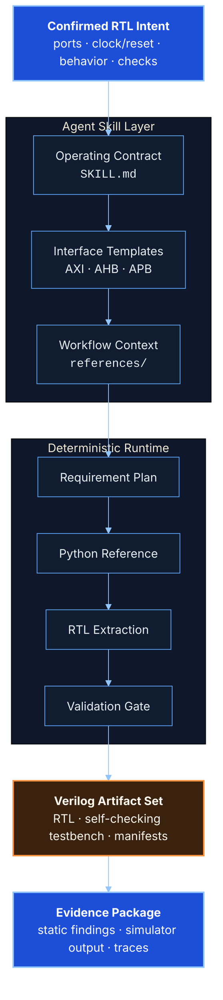
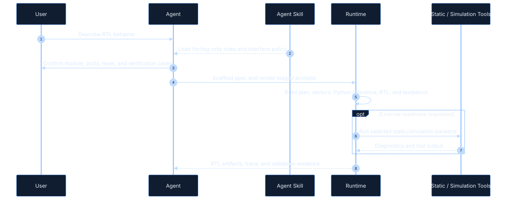

<p align="center">
  <a href="README.md"><strong>English</strong></a>
  <span>&nbsp;|&nbsp;</span>
  <a href="README-CN.md">中文</a>
</p>

<p align="center">
  
</p>

<p align="center">
  <a href="LICENSE"></a>
  <a href="pyproject.toml"></a>
  
  <a href="SKILL.md"></a>
  <a href="ENGINEERING_DESIGN_GOALS.md"></a>
</p>

<h1 align="center">Verilog Generator</h1>

<p align="center">
  A Codex-ready agent skill for disciplined Verilog-2001 RTL workflows.
</p>

Verilog Generator turns an AI coding agent into a more reliable RTL engineering assistant. It provides trigger metadata, workflow instructions, interface templates, deterministic runtime helpers, examples, and validation gates for moving from confirmed hardware intent to synthesizable Verilog and self-checking testbenches.

This repository is primarily an **agent skill package**. The Python CLI is included as the deterministic execution layer, but the main interface is the skill surface an agent can load and follow.

## Why It Exists

RTL work needs precision before code. Verilog Generator makes the agent confirm module names, ports, clock/reset behavior, pipeline expectations, interface family, reference behavior, and verification cases before producing artifacts.

Use it when an agent needs to work on:

- Synthesizable Verilog-2001 RTL modules.
- Self-checking Verilog testbenches.
- Python reference contracts for semantic comparison.
- AXI-Stream, AXI4-Lite, AXI4, AHB, APB, native, or custom interface shapes.
- Static validation, simulator readiness, workflow traces, and generated artifact review.

## Skill Architecture



## Workflow



## Repository Map

| Path | Purpose |
| --- | --- |
| `SKILL.md` | Agent-facing routing, workflow, constraints, and tool usage rules. |
| `agents/openai.yaml` | UI metadata for skill lists and invocation chips. |
| `runtime/verilog_generator/` | Deterministic scaffolding, prompt rendering, extraction, validation, traces, and workflow state. |
| `integration/verilog_adapter.py` | Stable host-facing facade for workflow, prompt, and validation calls. |
| `assets/interface_templates/` | Reusable AXI-Stream, AXI4-Lite, AXI4, AHB, and APB interface patterns. |
| `assets/examples/` | Example specs and fixed RTL fixtures for validation and regression checks. |

## Quick Start

Place this repository in a Codex skill search path to use it as an agent skill. For runtime development and local checks:

```powershell
python -m runtime.verilog_generator --version
python -m runtime.verilog_generator scaffold --name rtl_adapter --out .\reports\verilog\spec.json
python -m runtime.verilog_generator prompt --spec .\reports\verilog\spec.json --out .\reports\verilog\prompt.md
```

Static validation without external HDL tools:

```powershell
python -m runtime.verilog_generator validate --spec .\reports\verilog\spec.json --path .\reports\verilog\generated --no-external
```

External validation requires real HDL tools. This project does not claim Vivado/xsim, VCS, iverilog, or yosys acceptance unless those tools actually run.

## Integration API

```python
from integration.verilog_adapter import (
    render_verilog_prompt,
    run_verilog_workflow,
    validate_verilog_artifacts,
)
```

- `run_verilog_workflow(...)`: run or resume the staged RTL workflow.
- `render_verilog_prompt(...)`: render prompts when a host owns the model call.
- `validate_verilog_artifacts(...)`: validate generated RTL before downstream use.

## Scope

Verilog Generator is intentionally narrow:

- It generates Verilog-2001 `.v` artifacts and self-checking Verilog testbenches.
- It does not generate HLS, C/C++ kernels, or alternate RTL dialects.
- It prefers explicit logic over Verilog `function` and `task` blocks for easier waveform debugging.
- Local secrets, proprietary hardware designs, generated caches, and private remote-server details should stay out of the repository.

## Contact

For questions, collaboration, or academic use, contact: [erie@seu.edu.cn](mailto:erie@seu.edu.cn).

## Citation

If this skill helps your research, teaching, or engineering workflow, please cite it:

```bibtex
@software{verilog_generator_skill,
  title        = {Verilog Generator: An Agent Skill for Verilog-2001 RTL Workflows},
  author       = {Jiyuan Liu},
  year         = {2026},
  license      = {Apache-2.0},
  contact      = {erie@seu.edu.cn}
}
```

GitHub citation metadata is also available in [CITATION.cff](CITATION.cff).

## License

Apache License 2.0. See [LICENSE](LICENSE).
