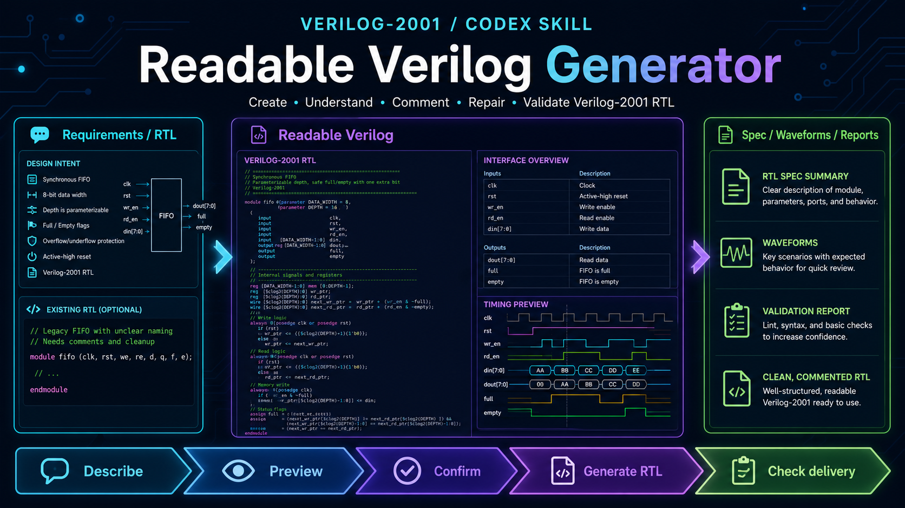
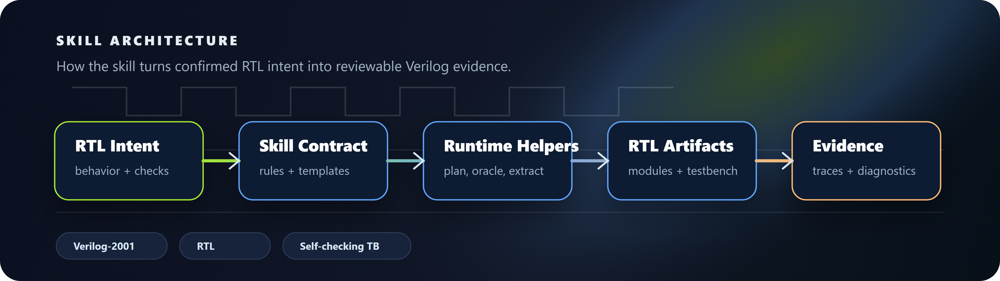
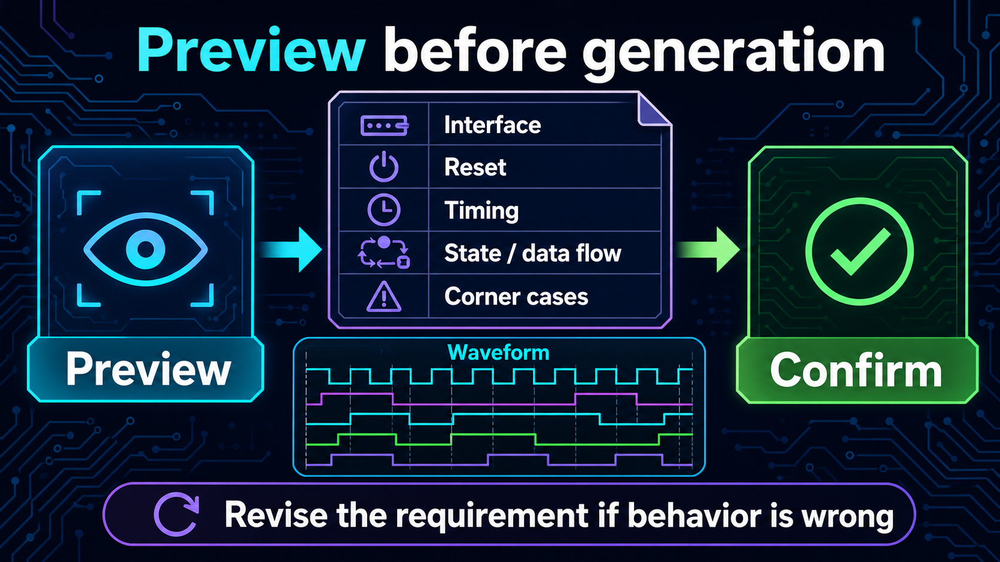
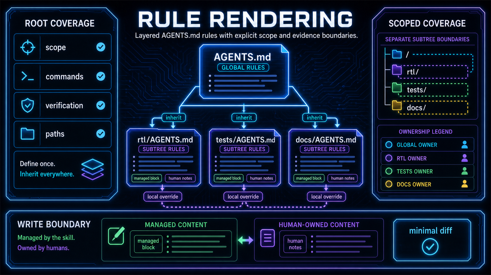

<p align="center">
  <a href="README.md"><strong>English</strong></a>
  <span>&nbsp;|&nbsp;</span>
  <a href="README-CN.md">Chinese</a>
</p>

<p align="center">
  
</p>

<p align="center">
  <a href="LICENSE"></a>
  
  
  
  
</p>

<p align="center">
  <strong>Readable RTL → traceable checks → installable package</strong><br>
  Define the interface, make behavior explicit, and carry real verification to handoff.
</p>

Verilog Generator is a Codex skill for everyday Verilog-2001 work. Give it a module requirement, existing RTL, a testbench, or a tool log. It can write a new module, explain old code, add semantic comments, or repair code against actual diagnostics.

The project keeps one boundary visible: generated RTL is only called verified when the corresponding check really ran. Static review, simulation, synthesis, and hardware results stay distinct, so the next engineer can read the code, reproduce the claim, and review the diff.

## Why use Verilog Generator?

- Start from ports, clocks, resets, timing expectations, and transaction rules instead of an underspecified prompt.
- Preserve Verilog-2001 readability with stable naming, semantic comments, and a deliberate design profile.
- Explain existing modules and testbenches through interfaces, state, timing paths, and risk locations.
- Repair against real diagnostics while keeping the change boundary and validation record explicit.
- Package the governed skill with versioned metadata, a receipt, and a reproducible installation path.

## 01 — Start from RTL intent



Write down the module purpose, ports, clock and reset behavior, data boundaries, and the checks that matter. The workflow keeps these project facts visible before generation or repair begins.

## 02 — Specify behavior before generation



Route each request through an explicit design profile: interface shape, timing assumptions, reset semantics, state transitions, and review scope. This gives the generated RTL a purpose that can be checked line by line.

## 03 — Carry verification through handoff



The final handoff keeps semantic comments, readability rules, and validation boundaries together. A local static result is labeled as static; an unrun simulator or synthesis tool is never presented as completed.

## Generated RTL example

The example below is a 32-bit AXI-Stream meter. It counts valid bytes only when `TVALID` and `TREADY` complete a transfer, counts packets on a transferred `TLAST`, and saturates instead of wrapping.

The complete source uses the `erie_strict` Chinese-first semantic-comment profile. This English excerpt translates those comments while preserving the same transaction conditions, data boundaries, and saturation behavior.

```verilog
// AXI-Stream transaction detection
assign flag_transfer = i_axis_tvalid & i_axis_tready; // Sample only after a valid-ready handshake
assign flag_packet_end = flag_transfer & i_axis_tlast; // End a packet only on a transferred TLAST

// Increment after the last beat transfers, then saturate at the counter limit
always@(posedge i_axis_aclk or negedge i_axis_arstn)begin
	if(i_axis_arstn == 1'b0)begin
		cnt_packet_o <= 32'd0;              // Clear the packet total on asynchronous reset
	end else if(i_clear == 1'b1)begin
		cnt_packet_o <= 32'd0;              // Clear the packet total on a software request
	end else if(flag_packet_end == 1'b1)begin
		if(data_frame_sum[32] == 1'b0)begin
			cnt_packet_o <= data_frame_sum[31:0]; // Store the new total when no carry occurs
		end else begin
			cnt_packet_o <= 32'hFFFF_FFFF;  // Hold the maximum value after saturation
		end
	end else begin
		cnt_packet_o <= cnt_packet_o;       // Keep the total when no packet completes
	end
end
```

**[Open the complete commented source →](assets/examples/readme/axis_packet_meter.v)**

| Repository-local static gate | Result |
| --- | ---: |
| Formatter AST | `PASS` |
| Readability, comments, naming, profile | `PASS` |
| Errors | `0` |
| Strict warnings | `0` |

> This is a repository-local static result. No simulator, synthesis, hardware, or remote-tool result is claimed here.

## Get started

> Tell Codex: `Install https://github.com/Eriemon/verilog-generator`

Restart Codex after installation so the skill is discovered. For a reproducible local install, use the validated package directory `dist/readable-verilog-generator-v1.2.0/`; `VERSION`, `pyproject.toml`, and `CITATION.cff` carry the same package version.

The public repository is [Eriemon/verilog-generator](https://github.com/Eriemon/verilog-generator). A local mirror is kept under `github/readable-verilog-generator/` with its `.git` history intact. The mirror is built from versioned `dist/` directories one release at a time; it is not a substitute for a GitHub tag, release, or push.

## Develop locally, mirror deliberately

The source of truth is `skills/readable-verilog-generator/`. The governed release flow produces `dist/readable-verilog-generator-vX.Y.Z/` and its receipt before any mirror copy is made. The mirror helper checks the existing repository, copies one validated package, and leaves commit, tag, push, and GitHub Release decisions to the repository owner.

```text
source skill  →  versioned dist + receipt  →  local GitHub mirror
```

Keep the package boundary inspectable: required public files stay at the skill root, generated runtime state stays out of the public package, and README images are local PNG assets with matching English and Chinese variants.

## Authors and citation

Jiyuan Liu and He Li · Southeast University · 东南大学 · HIQC (Heterogeneous Intelligence and Quantum Computing Laboratory)

If this skill supports your research, teaching, or engineering work, cite the governed package below. [CITATION.cff](CITATION.cff) remains the canonical metadata source.

```bibtex
@software{liu_2026_verilog_generator,
  author       = {Jiyuan Liu and He Li},
  title        = {{Verilog Generator}: An Agent Skill for Verilog-2001 RTL Workflows},
  year         = {2026},
  version      = {1.2.0},
  date         = {2026-08-12},
  url          = {https://github.com/Eriemon/verilog-generator},
  license      = {Apache-2.0},
  note         = {Agent skill package for disciplined Verilog-2001 RTL workflows}
}
```

---

<p align="center">
  <a href="SKILL.md">Skill contract</a>
  <span>&nbsp;&bull;&nbsp;</span>
  <a href="LICENSE">Apache-2.0</a>
  <span>&nbsp;&bull;&nbsp;</span>
  <a href="LICENSE">Apache License 2.0</a>
  <span>&nbsp;&bull;&nbsp;</span>
  <a href="CITATION.cff">Citation</a>
  <span>&nbsp;&bull;&nbsp;</span>
  <a href="mailto:<REDACTED_EMAIL>">Contact</a>
</p>
