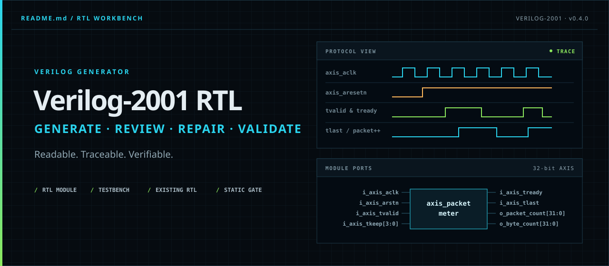
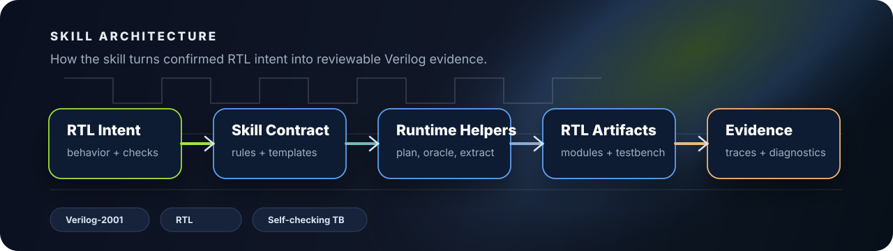
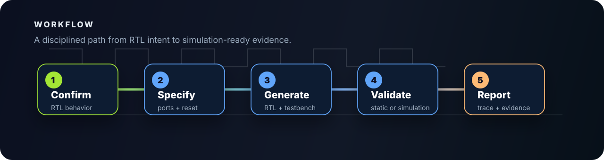

<p align="center">
  <a href="README.md"><strong>English</strong></a>
  <span>&nbsp;|&nbsp;</span>
  <a href="README-CN.md">Chinese</a>
</p>

<p align="center">
  
</p>

<p align="center">
  <a href="LICENSE"></a>
  <a href="pyproject.toml"></a>
  
  <a href="SKILL.md"></a>
  <a href="ENGINEERING_DESIGN_GOALS.md"></a>
</p>

<h1 align="center">Verilog Generator</h1>

<p align="center">
  A Codex-ready agent skill for disciplined Verilog-2001 RTL and FPGA design workflows.
</p>

Verilog Generator turns an AI coding agent into a more reliable RTL and FPGA engineering assistant. It provides trigger metadata, workflow instructions, interface templates, deterministic runtime helpers, examples, and validation gates for moving from confirmed hardware intent to synthesizable Verilog, FPGA-oriented module design, and self-checking testbenches.

This repository is primarily an **agent skill package**. The Python CLI is included as the deterministic execution layer, but the main interface is the skill surface an agent can load and follow.

## Why It Exists

RTL work needs precision before code. Verilog Generator makes the agent confirm module names, ports, clock/reset behavior, pipeline expectations, interface family, reference behavior, and verification cases before producing artifacts.

Use it when an agent needs to work on:

- Synthesizable Verilog-2001 RTL modules.
- Self-checking Verilog testbenches.
- Python reference contracts for semantic comparison.
- AXI-Stream, AXI4-Lite, AXI4, AHB, APB, native, or custom interface shapes.
- Static validation, simulator readiness, workflow traces, and generated artifact review.

## Skill Architecture

<p align="center">
  
</p>

## Workflow

<p align="center">
  
</p>

## What's New In v0.3.6

- Ships formatter-backed Verilog style assets and structured rule data through `assets/verilog_formatter_config/`, `assets/verilog_style_rules.json`, `runtime/verilog_generator/formatter_ast.py`, and `runtime/verilog_generator/rulebook.py`, so normalization and policy checks share the same source of truth.
- Adds a stricter readability and final-deliverable path through `references/checklists/verilog_readability_gate.md`, `scripts/verilog_generated_deliverable_gate.py`, `runtime/verilog_generator/quality_gate.py`, `runtime/verilog_generator/deliverable_gate.py`, and `assets/ideal_bad_style_metrics.json`.
- Splits the CLI into focused command modules and introduces a workflow dispatcher via `runtime/verilog_generator/cli_*`, `route-workflow`, `runtime/verilog_generator/workflow_execution.py`, `runtime/verilog_generator/workflow_gates.py`, `runtime/verilog_generator/workflow_stage.py`, and `references/workflows/verilog_dispatcher.md`.
- Adds explicit dependency and remote-validation routing through `scripts/manage_skill_dependencies.py`, the `skill_dependencies` and FPGA routing settings in `config/defaults.json`, and the guidance in `references/configuration.md`, so agents can route remote SSH and FPGA developer flows without hardcoding local helper paths.

## Repository Map

| Path | Purpose |
| --- | --- |
| `SKILL.md` | Agent-facing routing, workflow, constraints, and tool usage rules. |
| `agents/openai.yaml` | UI metadata for skill lists and invocation chips. |
| `runtime/verilog_generator/` | Deterministic scaffolding, prompt rendering, extraction, validation, workflow routing, and staged execution helpers. |
| `integration/verilog_adapter.py` | Stable host-facing facade for workflow, prompt, and validation calls. |
| `assets/verilog_formatter_config/` | Formatter profiles, schema, and reusable task templates for style normalization and audits. |
| `assets/verilog_style_rules.json` | Structured naming, comment, and layout rule data shared by the gates. |
| `references/checklists/` | Human review checklists, including the final Verilog readability gate. |
| `references/workflows/` | Read-only workflow dispatcher references for generation, modification, comment-only, analysis, and validation tasks. |
| `scripts/manage_skill_dependencies.py` | Dependency check, install, adapt, and FPGA routing helper for remote and developer skills. |
| `scripts/verilog_generated_deliverable_gate.py` | Final generated-RTL deliverable gate for strict release-ready checks. |
| `evals/` | Repo-local skill-effectiveness cases for workflow and remote-validation regressions. |
| `RELEASE_RECEIPT.json` | Imported provenance record for the staged `v0.3.6` package; GitHub release assets are rebuilt from this repository state before upload. |

## Quick Start

Tell your AI assistant: install https://github.com/Eriemon/verilog-generator

Pin the public release with tag `v0.3.6` or the rebuilt `erie-verilog-generator-v0.3.6.zip` asset from GitHub Releases.

Place this repository in a Codex skill search path to use it as an agent skill. For runtime development and local checks:

```powershell
python -m runtime.verilog_generator --version
python .\scripts\manage_skill_dependencies.py check --settings .\config\defaults.json
python -m runtime.verilog_generator scaffold --name rtl_adapter --out .\reports\verilog\spec.json
python -m runtime.verilog_generator prompt --spec .\reports\verilog\spec.json --out .\reports\verilog\prompt.md
```

Static validation without external HDL tools:

```powershell
python -m runtime.verilog_generator validate --spec .\reports\verilog\spec.json --path .\reports\verilog\generated --no-external
python .\scripts\verilog_generated_deliverable_gate.py .\reports\verilog\generated
```

Use `route-workflow` when a host wants a read-only entry classification before any RTL files are written.

External validation requires real HDL tools. This project does not claim Vivado/xsim, VCS, iverilog, or yosys acceptance unless those tools actually run.

Release provenance note: the `v0.3.6` GitHub release asset is rebuilt from this repository after the latest staged package is imported and reviewed. The original archive under `tmp/` is used only as local import input and is never uploaded directly.

## Integration API

```python
from integration.verilog_adapter import (
    analyze_existing_verilog,
    compare_verilog_semantics,
    refine_existing_verilog,
    render_verilog_prompt,
    run_verilog_batch,
    run_verilog_workflow,
    validate_verilog_artifacts,
    verify_existing_verilog,
)
```

- `analyze_existing_verilog(...)`: analyze existing RTL into stable JSON contracts and a durable design explanation.
- `refine_existing_verilog(...)`: plan controlled refinement flows such as testbench scaffold, style refine, partition assist, merge assist, and optimize assist.
- `compare_verilog_semantics(...)`: compare candidate and reference RTL for interface and checkpoint drift.
- `run_verilog_batch(...)`: execute generation-only batches across isolated case run directories.
- `run_verilog_workflow(...)`: run or resume the staged RTL workflow.
- `render_verilog_prompt(...)`: render prompts when a host owns the model call.
- `validate_verilog_artifacts(...)`: validate generated RTL before downstream use.
- `verify_existing_verilog(...)`: run the existing-RTL verify-repair loop and emit diagnostics, patch plans, and closure artifacts.

## Scope

Verilog Generator is intentionally narrow:

- It generates Verilog-2001 `.v` artifacts and self-checking Verilog testbenches.
- It does not generate high-level-synthesis flows, C/C++ kernels, or alternate RTL dialects.
- It prefers explicit logic over Verilog `function` and `task` blocks for easier waveform debugging.
- Local secrets, proprietary hardware designs, generated caches, and private remote-server details should stay out of the repository.
- Project-local remote settings should live under `.settings/`, and this public repository intentionally avoids keeping repo-tracked `smoke/` or test-only validation source directories.

## Affiliation

Jiyuan Liu and He Li are with the School of Electronic Science and Engineering, Southeast University.
They are affiliated with the Heterogeneous Intelligence and Quantum Computing Laboratory (HIQC), which works on heterogeneous intelligence, quantum computing, and related computing systems research.

## Contact

For questions, collaboration, or academic use, contact: [erie@seu.edu.cn](mailto:erie@seu.edu.cn).

## Citation

This skill is maintained by authors from the Heterogeneous Intelligence and Quantum Computing Laboratory (HIQC), School of Electronic Science and Engineering, Southeast University.

If this skill helps your research, teaching, or engineering workflow, please cite it. The canonical citation metadata is maintained in [CITATION.cff](CITATION.cff).

```bibtex
@software{liu_2026_verilog_generator,
  author       = {Jiyuan Liu and He Li},
  title        = {{Verilog Generator}: An Agent Skill for Verilog-2001 RTL Workflows},
  year         = {2026},
  version      = {0.3.6},
  date         = {2026-07-02},
  url          = {https://github.com/Eriemon/verilog-generator},
  license      = {Apache-2.0},
  note         = {Agent skill package for disciplined Verilog-2001 RTL workflows}
}
```

## License

Apache License 2.0. See [LICENSE](LICENSE).
